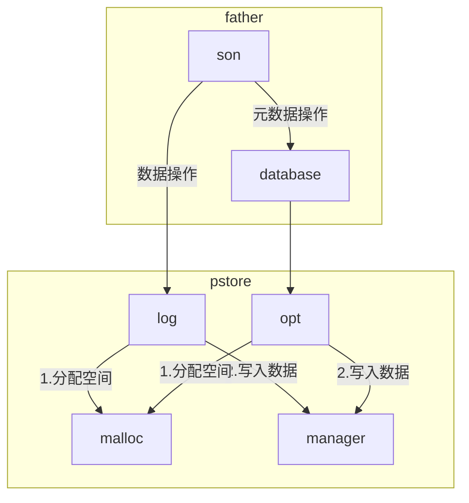

## 各模块联系图


## 更详细的架构图


## 核心代码结构
```code
hello_world
├── DEBIAN
│   └── control
├── hello
│   ├── DEBIAN
│   │   └── control
│   └── opt
│       └── hello.py
├── hello_1.0_linux_amd64.deb
├── lib
│   ├── a
│   ├── b
│   └── c
├── usb
│   ├── a
│   ├── b
│   ├── c
│   └── lib
│       ├── a
│       ├── b
│       └── c
└── usc
    ├── a
    ├── b
    ├── c
    └── opt
        └── hello.py

21 directories, 5 files
```


#ifndef container_of
#define container_of(ptr, type, member) ({                      \
        const typeof(((type *) 0)->member) *__mptr = (ptr);     \
        (type *) ((char *) __mptr - offsetof(type, member));})
#endif

#define sizeof_field(type, field) sizeof(((type *)0)->field)

/*
 * Calculate the number of bytes up to and including the given 'field' of
 * 'container'.
 */
#define endof(container, field) \
    (offsetof(container, field) + sizeof_field(container, field))

/* Convert from a base type to a parent type, with compile time checking.  */
#ifdef __GNUC__
#define DO_UPCAST(type, field, dev) ( __extension__ ( { \
    char __attribute__((unused)) offset_must_be_zero[ \
        -offsetof(type, field)]; \
    container_of(dev, type, field);}))
#else
#define DO_UPCAST(type, field, dev) container_of(dev, type, field)
#endif


